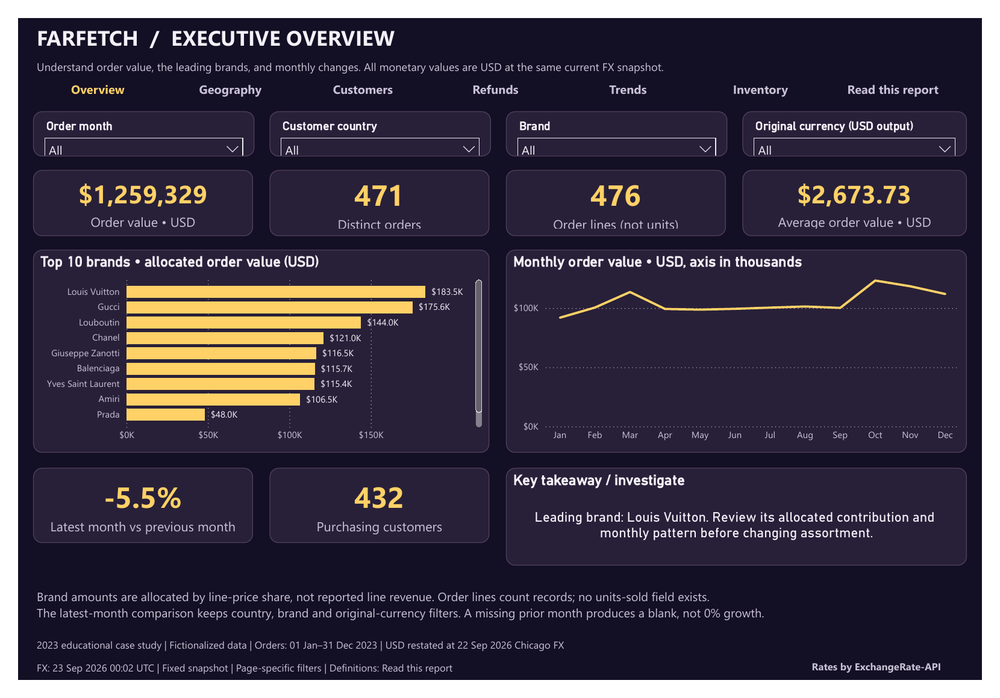
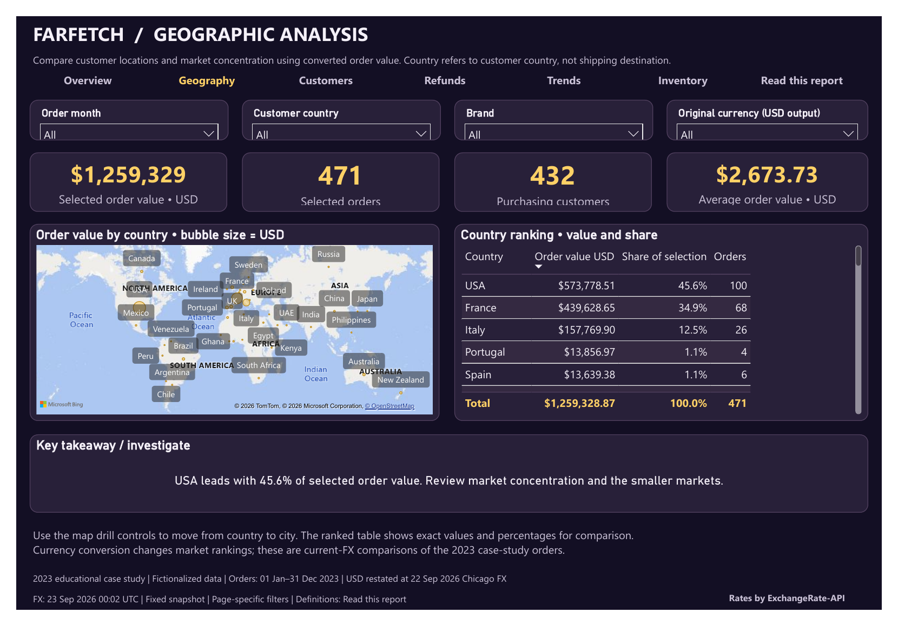
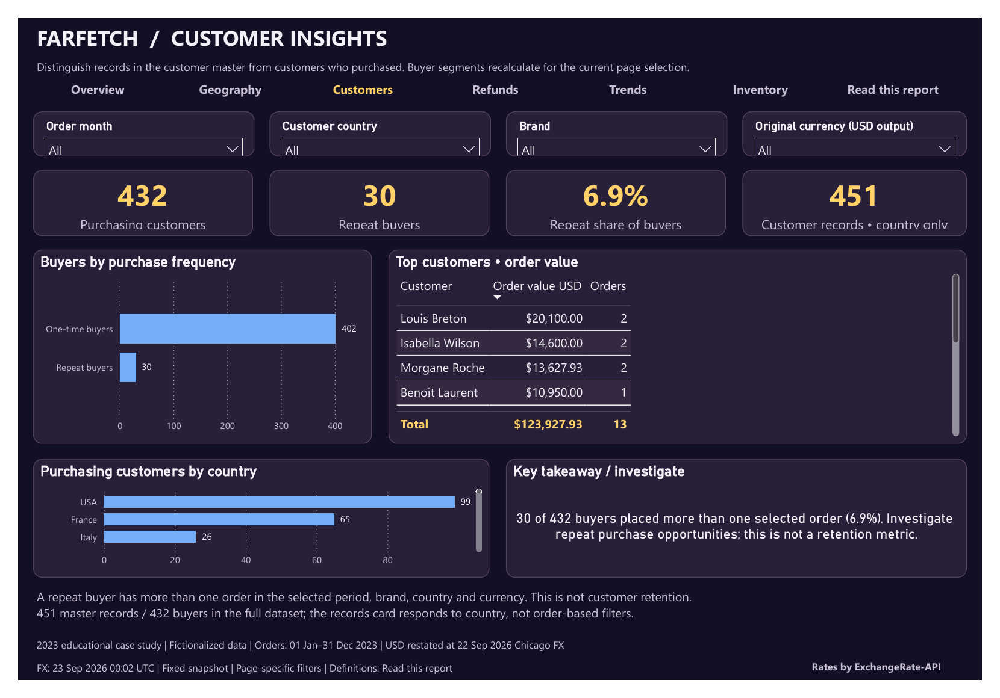
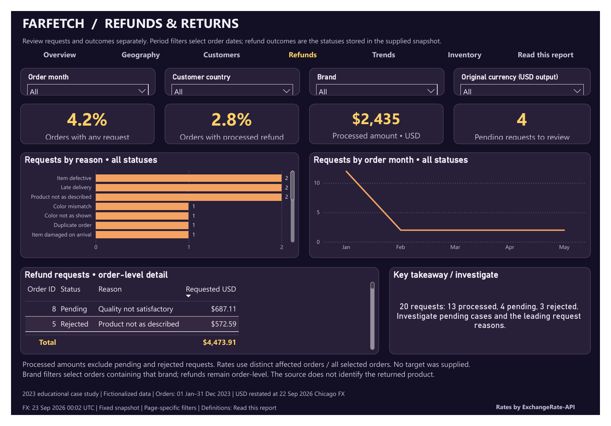
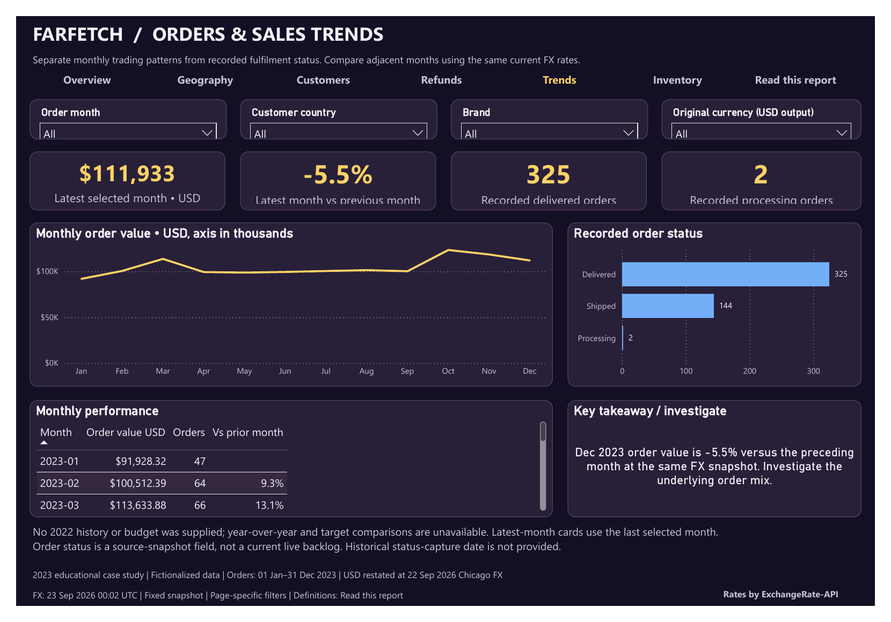
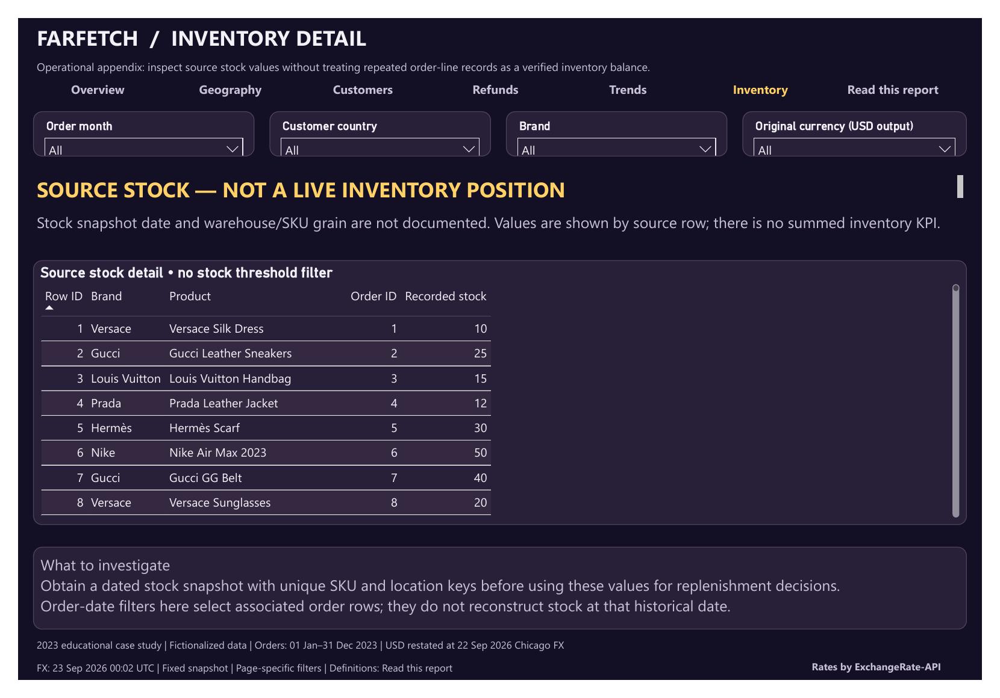
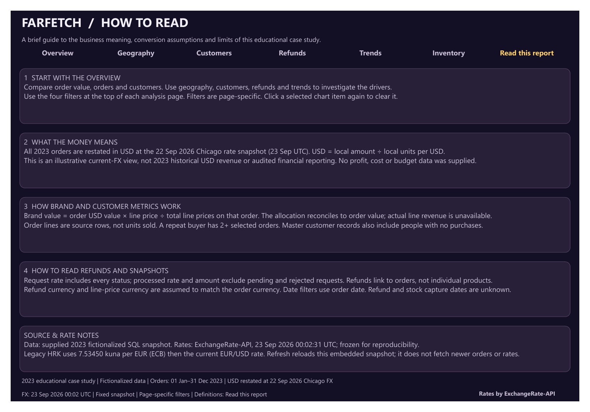

# Farfetch | Executive Sales Analytics

A seven-page Power BI report exploring 2023 order value, customer behavior, geographic performance and refund outcomes. It brings 34 original currencies into a consistent USD view and pairs the results with clear definitions and questions to investigate.

**[Download the Power BI report](Farfetch.pbix?raw=true)** · [Browse all screenshots](docs/)

## At a glance

| Metric | Full-year result |
|---|---:|
| Converted order value | **$1,259,328.87 USD** |
| Orders | **471** |
| Order lines | **476** |
| Average order value | **$2,673.73 USD** |
| Purchasing customers | **432** |
| Repeat buyers | **30 · 6.9%** |
| Refund requests | **20** |
| Processed refunds | **13 · $2,434.90 USD** |

## What the report shows

- **Market concentration:** the USA and France account for approximately **80.5%** of converted order value. Their contribution makes market concentration a useful starting point for discussion.
- **Brand contribution:** Louis Vuitton leads allocated order value. Brand values split each order by its lines' price shares.
- **Customer behavior:** **402 buyers purchased once** and **30 purchased more than once**. This highlights a repeat-purchase opportunity; it is not a retention measure.
- **Monthly movement:** October has the highest converted order value, at **$123,314.20**. December is **5.5% below November**.
- **Refund follow-up:** requests comprise **13 processed, 4 pending and 3 rejected**. Pending cases and request reasons are separated from processed refund amounts.

## Explore the report

### Geographic Analysis

Compare customer countries on the map and use the ranked table to see their value, share and order count. The USA contributes **45.6%**, France **34.9%** and Italy **12.5%**.

### Customer Insights

See purchasing customers, repeat buyers and top customers. The report distinguishes the **451 customer records** from the **432 customers who placed orders**.

### Refunds & Returns

Review request reasons, outcomes and order-level detail. **4.2% of orders** have a request; **2.8%** have a processed refund.

### Orders & Sales Trends

Follow monthly order value and month-over-month changes alongside recorded order status. Missing prior-period data stays blank.

### Inventory Detail

Inspect recorded stock by source row. This appendix explains why the available records cannot establish a current inventory balance.

### How to Read

A built-in guide explains navigation, filters, currency conversion, metric definitions and the limits of the data.

## Open and explore

Download **[Farfetch.pbix](Farfetch.pbix?raw=true)** and open it in Power BI Desktop. The data is included; no MySQL connection is needed. To edit the project files, download the repository and open **[Farfetch.pbip](Farfetch.pbip)**, then refresh.

Start with Executive Overview, then filter by order month, customer country, brand or original currency. Filters apply to the current page. In Desktop edit mode, use **Ctrl+click** on the navigation buttons. Scroll inside charts and tables for additional entries.

## Data and interpretation

This independent educational case study uses fictionalized 2023 retail data and is not affiliated with Farfetch. USD values restate the orders using a fixed **23 September 2026, 00:02 UTC** rate snapshot (**22 September in Chicago**), rather than historical transaction-date exchange rates. Refresh reloads the included snapshot; it does not retrieve newer orders or rates.

Order lines are records, not units sold. Refunds belong to orders; their currency is assumed to match the order currency. Profit, budget and prior-year comparisons are outside the supplied data.

Exchange-rate attribution: **[ExchangeRate-API](https://www.exchangerate-api.com/)**. Legacy HRK conversion uses the **[ECB's fixed HRK/EUR rate](https://www.ecb.europa.eu/press/pr/date/2022/html/ecb.pr220712~b97dd38de3.en.html)**.
