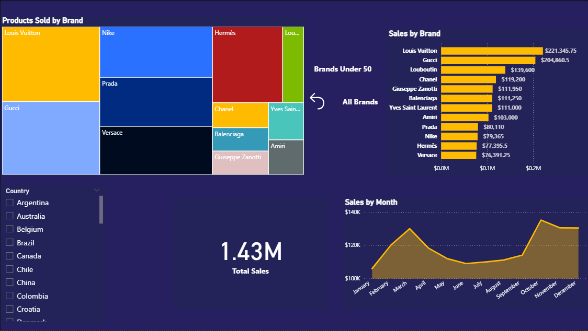

# Farfetch Sales Analytics Dashboard


An interactive Power BI case study examining 2023 sales, customer, geographic, order, inventory, and refund performance for a fictionalized Farfetch retail dataset.

> This is an independent educational portfolio project. It is not an official Farfetch report and is not affiliated with or endorsed by Farfetch.

## Dashboard preview

The report uses a premium navy-and-plum visual system, Farfetch-inspired gold accents, compact navigation, searchable filters, bookmarks, and contextual tooltip pages.

<!-- Replace this image with the final clean Sales Performance screenshot before publishing. -->


## Business objective

The project turns transactional retail data into a decision-focused dashboard that answers:

- Which brands, products, and countries generate the most sales?
- How does performance change throughout the year?
- Which customers and customer segments contribute most?
- What is the average order value?
- Which products and payment methods drive refunds?
- Is the refund rate within an acceptable operating range?

## Report pages

1. **Sales Performance** — total sales, products sold, orders, average order value, brand performance, and monthly sales.
2. **Geographic Analysis** — country and city sales distribution, interactive map bubbles, and ranked country performance.
3. **Customer Insights** — customer segments, top customers, customer sales, location filters, and country distribution.
4. **Refunds & Returns** — refund rate, refunded products, refund value, and payment-method analysis.
5. **Orders & Sales Trends** — monthly trends, order status, inventory by brand, and average order value.

Two hidden report pages provide focused product and brand tooltips without overcrowding the main report.

## Key measures

- Total Sales
- Total Quantity Sold
- Number of Orders
- Average Order Value
- Customer Count
- Refund Count
- Total Refund Amount
- Refund Rate
- Average Product Price
- Total Stock Quantity

## Design and interaction

- Premium navy/plum canvas with translucent rounded panels
- Gold for primary sales metrics, blue for customer/geographic information, and amber/red for refund risk
- Consistent navigation across all five pages
- Searchable Country, City, and Brand slicers
- Top-customer, brand-focus, reset, and drillthrough bookmarks
- Report-page tooltips for product and brand context
- Consistent currency, percentage, and count formatting
- Cross-filtering between related visuals

## Key observations

- Sales are concentrated among a relatively small group of leading brands and countries.
- The United States and France are among the strongest geographic markets.
- Monthly sales vary throughout the year, highlighting periods for deeper commercial analysis.
- Customer segmentation reveals meaningful differences in the composition of the customer base.
- The refund rate is approximately 4%, making returns an important operating KPI to monitor.

## Repository structure

```text
Farfetch.pbip                  Power BI project entry point
Farfetch.Report/              Report pages, visuals, theme, and bookmarks
Farfetch.SemanticModel/       Data model, Power Query, relationships, and DAX measures
docs/                         Portfolio screenshots and supporting assets
README.md                     Project case study
```

The local `.pbix`, database export, generated cache files, working backups, and development screenshots are excluded from the public repository.

## Open the project

1. Install a current version of Power BI Desktop.
2. Clone or download this repository.
3. Open `Farfetch.pbip`.
4. Update the MySQL source credentials and server/database settings in Power Query if you have access to a compatible dataset.
5. Refresh the model.

The report currently references a local MySQL source. The raw dataset is intentionally not published in this repository.

## Skills demonstrated

- Power BI Desktop and PBIP project structure
- Power Query transformation
- Relational data modeling
- DAX measure development
- KPI and business-question selection
- Bookmarks, drillthrough, and report-page tooltips
- Interactive navigation and slicer design
- Dashboard UX, accessibility, and visual storytelling

## Portfolio summary

This project demonstrates an end-to-end analytics workflow: preparing relational retail data, building reusable measures, designing an interactive report, validating user interactions, and translating the output into a stakeholder-ready business narrative.
